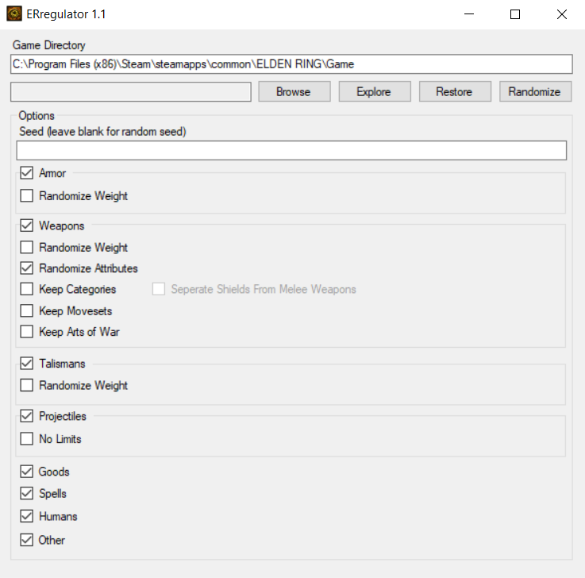

# ERregulator
Simple tool for randomization of game parameters in Elden Ring, based on JKAnderson's [Irregulator](https://github.com/JKAnderson/Irregulator) for DS3. 

## Usage
The usage of this application requires .NET Framework 4.7.2 to work. 
Please download the latest release from the [Releases](https://github.com/arthurb123/ERregulator/releases) page, or refer to [Building from source](#building-from-source) on how to create an executable yourself.
1. Run the ERregulator app and make sure the game directory is correct before proceeding.
2. Pick your options, click Randomize and wait for the process to finish.
3. Your game is now using modified parameters.

## Uninstallation
1. Run the ERregulator app and make sure the game directory is correct before proceeding.
2. Click Restore and wait for the process to finish.
3. Your game is now back to using the vanilla parameters.

## Building from source
1. Clone the GitHub repository, making sure to clone submodules using ``git clone --recursive``. 
   This project requires that the SoulsFormats submodule is on the [Elden Ring](https://github.com/JKAnderson/SoulsFormats/tree/er) branch, not the master branch. 
   To confirm that you are using the correct branch, use ``git checkout er`` in the SoulsFormats submodule folder.
3. Open the ERregulator solution in Visual Studio and download the necessary NuGet packages.
4. Build the project using Visual Studio, or by using ``dotnet build``. 
   If you get a targeting error for the SoulsFormats submodule, make sure SoulsFormats targeting framework is set to ``net472``. 

To use the app, please refer to [Usage](#usage).

## Credits
[Costura.Fody](https://github.com/Fody/Costura) by Simon Cropp, Cameron MacFarland

[Octokit](https://github.com/octokit/octokit.net) by GitHub

[Semver](https://github.com/maxhauser/semver) by Max Hauser

[Paramdex](https://github.com/soulsmods/Paramdex) by soulsmods

[SoulsFormats](https://github.com/JKAnderson/SoulsFormats) by JKAnderson
